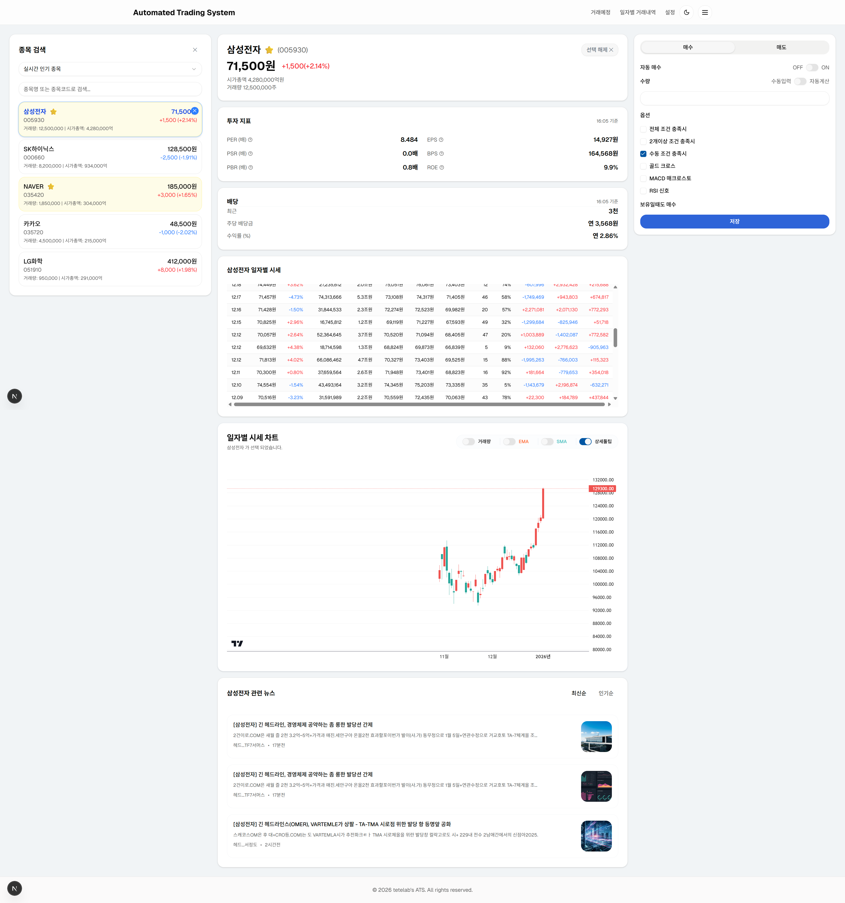

# 🚀 Automated Trading System

Next.js 기반 한국(키움증권) 주식 자동매매 시스템

## ✨ 주요 기능

- **📊 실시간 대시보드**: 웹 주식 차트, 뉴스, 관심종목 관리
- **🤖 자동매매**: RSI 기반 매수/매도 조건 설정
- **📈 거래 내역**: 상세한 매매 기록 및 수익률 분석
- **⚙️ 설정 관리**: 키움증권 API 연동 및 매매 조건 설정

## 🛠️ 기술 스택

- **Frontend**: Next.js 19, React 19, TypeScript
- **Backend**: Java, SpringBoot, JPA
- **DB**: Mysql, Redis
- **UI**: Tailwind CSS, Radix UI, shadcn/ui
- **Charts**: Recharts, Lightweight Charts
- **API**: 키움증권 OpenAPI

## 🚦️ 현재 화면 (30% 완료)

## 📜 문의
- 작업에 관련된 내용은 https://blog.tetelab.dev 에 올리고 있음
- ktgstar@gmail.com